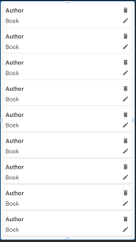
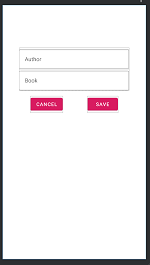
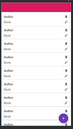

# Book-Keeper-GADS-2021

A rewritten version of the Book Keeper project of the  Android: Room Fundamentals course on ```pluralsight```

This GADS21 repo  contains updated ```dependencies```,```components``` and ```Functions``` from the course creation as of 2021 September

### Main updates on:

    using Material Design Componets

    Coroutines

    RegisterForActivityResult() API for making callBack

    ViewBinding

### Improvements on

    New search feature instead of creating a new activity as Deep Dive course used.

### Screenshot of the final app:

  


    


